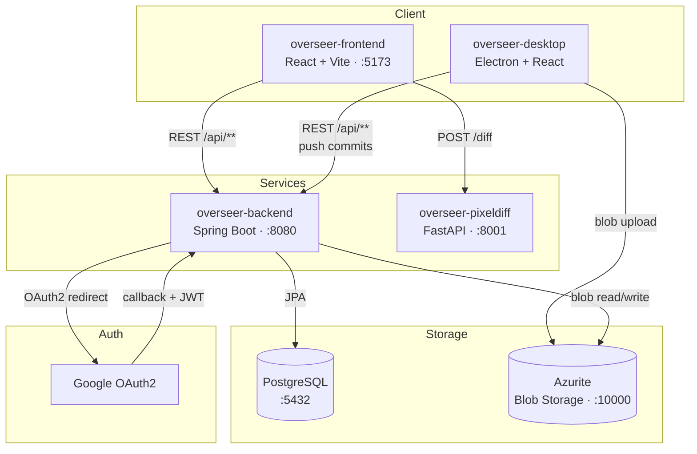
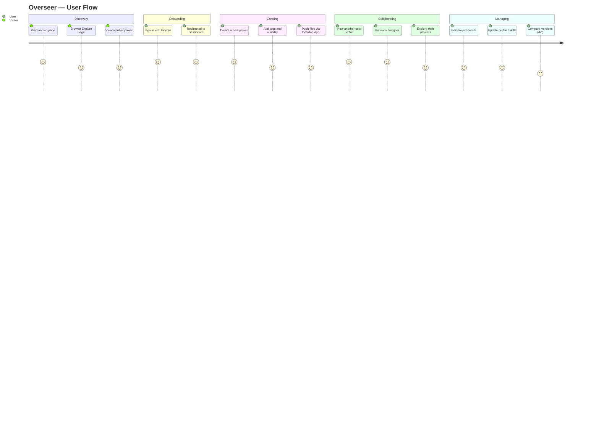

# Overseer

  
  
  
  
  
  
  
  
  

---
A version control system and social network for designers — manage, store, and publish design projects with a visually appealing interface. Designers can track project history, collaborate, and explore work from others in a comfortable, structured environment.

---

## Architecture

Overseer is composed of four services orchestrated with Docker Compose:

| Service | Tech | Port | Purpose |
|---|---|---|---|
| `overseer-backend` | Spring Boot (Java 21) | 8080 | REST API, auth, database |
| `overseer-frontend` | React + Vite + Tailwind | 5173 | Web client |
| `overseer-desktop` | Electron + React | — | Desktop app for pushing commits |
| `overseer-pixeldiff` | FastAPI + Python | 8001 | SSIM-based pixel diff microservice |

**Storage:** PostgreSQL (via JPA) + Azurite (Azure Blob Storage emulator for local dev)

**Auth:** Google OAuth2 → JWT

---

## Features

- **Google OAuth2 + JWT authentication** — secure sign-in, protected routes, auth callback flow
- **Projects** — create, edit, and publish design projects with tags, visibility settings, and README
- **Sheets & files** — version-controlled file uploads organized into sheets per project
- **Profile** — editable Identity / Links / Skills sections, tag picker for skills, follow/unfollow users
- **Explore** — browse public projects from all users
- **Dashboard** — welcome banner with quick access to your recent projects
- **Pixel diff** — FastAPI microservice using SSIM perceptual diff to compare image versions
- **Desktop app** — Electron client dedicated to pushing project commits (web client is read-only for commits)
- **GitHub Actions CI** — three parallel jobs: frontend lint+build, backend compile, pixeldiff syntax check

### Design system
Consistent color palette applied site-wide: blue `#60a5fa` · violet `#a78bfa` · pink `#f472b6` · green `#34d399`

### User path

---

## Changelog

| Version | Date       | Changes                                                                                                                                                                                                                                                                  |
|---------|------------|--------------------------------------------------------------------------------------------------------------------------------------------------------------------------------------------------------------------------------------------------------------------------|
| 0.1.0   | 2026-03-18 | Spring Boot backend (Java 21) with Google OAuth2 + JWT auth, REST endpoints for users/projects/sheets/files, PostgreSQL via JPA, Swagger UI with Bearer token support, Docker Compose with PostgreSQL service, React + Vite frontend scaffold, Electron desktop scaffold |
| 0.1.1   | 2026-04-04 | React + Tailwind frontend, Azurite for local blob storage                                                                                                                                                                                                               |
| 0.1.2   | 2026-04-07 | Full authentication flow (Google OAuth2 callback, JWT context, protected routes), all main pages (Landing, Dashboard, Explore, Profile, Project, NewProject, Settings, NotFound), API client layer, ProjectCard component, Navbar                                        |
| 0.1.3   | 2026-04-08 | FastAPI pixel diff microservice (SSIM) in `overseer-pixeldiff/` on port 8001, EditProject page, TagPicker component, Settings page with Identity/Links/Skills sections, profile page overhaul, consistent color palette, fixed Google avatar loading (`referrerPolicy="no-referrer"`) |
| 0.1.4   | 2026-04-19 | Expanded frontend pages (ProjectPage, NewProjectPage, NotFoundPage), desktop app pages (Login, Workspace, PushFolderModal), Electron IPC for git-style pushes, reusable components (Modal, PageBanner, Section, Field, AlertBanner, VisibilityPicker), GitHub Actions CI |