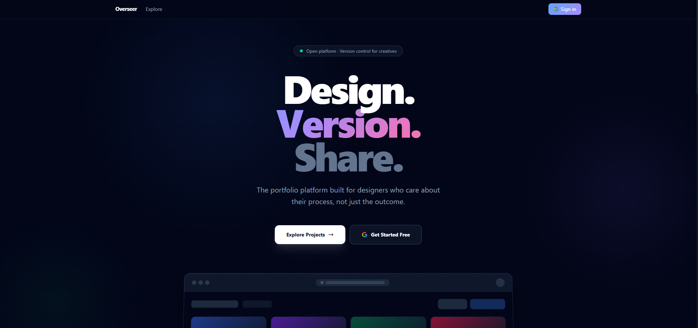
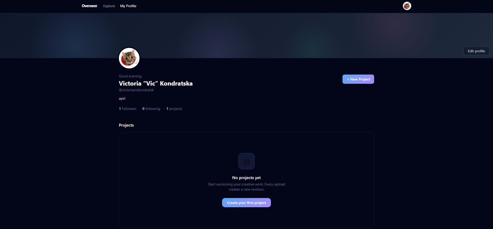
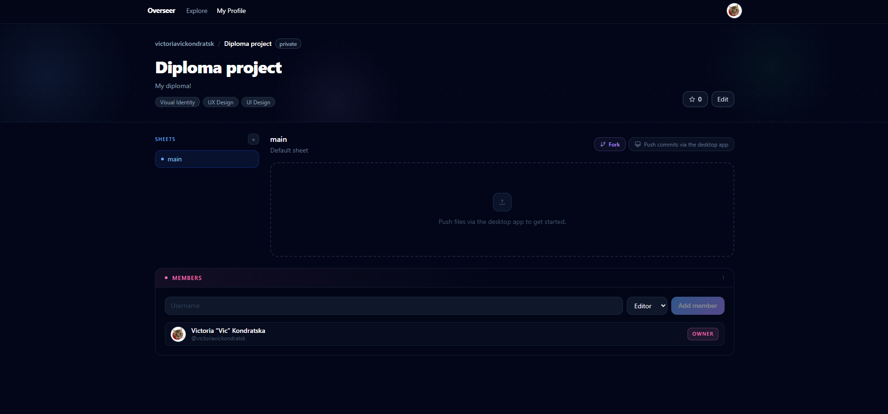
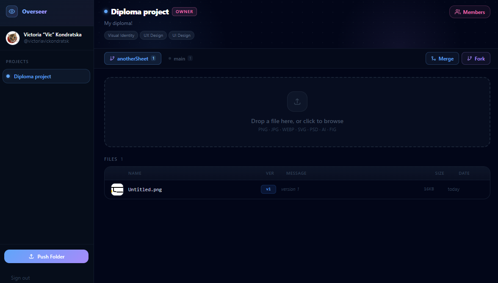
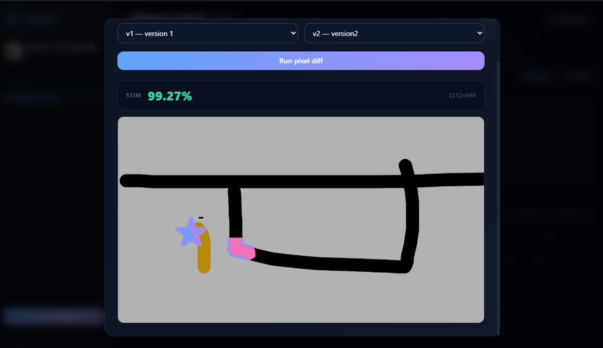

# 📘 Overseer

> *Колаборативна система контролю версіювання та соціальна платформа для дизайнерських проєктів.*
> Дозволяє зберігати історію змін, порівнювати версії візуальних артефактів за допомогою перцептуального діффу (SSIM) та публікувати роботи у спільноті.

---

## 👤 Автор

- **ПІБ**: Кондрацька Вікторія Юріївна
- **Група**: ФеП-42с
- **Керівник**: асистент Мисюк Ірина Володимирівна
- **Дата виконання**: 31.05.2026

---

## 📌 Загальна інформація

- **Тип проєкту**: Багатосервісний веб- та десктоп-застосунок (мікросервісна архітектура)
- **Мови програмування**: Java 21, JavaScript (React + Electron), Python 3.11
- **Фреймворки / Бібліотеки**: Spring Boot, React + Vite, Tailwind CSS, Electron, FastAPI, scikit-image, JPA/Hibernate
- **Інфраструктура**: Docker Compose, PostgreSQL, Azurite (емулятор Azure Blob Storage), Google OAuth2 + JWT
- **CI**: GitHub Actions (паралельні задачі для frontend, backend, pixeldiff)

---

## 🧠 Опис функціоналу

- 🔐 Авторизація через Google OAuth2 з видачею JWT-токенів
- 🗂️ Створення, редагування та публікація дизайн-проєктів з тегами, README та налаштуваннями видимості
- 📑 Версіонування файлів, організованих у листи (sheets) у межах проєкту
- 🖼️ **Pixel diff** — мікросервіс на FastAPI, що порівнює зображення за метрикою SSIM та генерує візуалізацію розбіжностей
- 💻 Десктоп-клієнт (Electron) для git-style push коммітів з локальної файлової системи
- 🌐 Web-клієнт (read-only для коммітів) — Dashboard, Explore, Profile, Project, Settings
- 👥 Соціальні функції — підписка на інших дизайнерів, перегляд їх проєктів
- 💾 Зберігання файлів у Azure Blob Storage (локально — Azurite), метаданих — у PostgreSQL
- 📦 Повне розгортання через Docker Compose

---

## 🧱 Опис основних класів / файлів

| Файл / Модуль                                            | Призначення                                                |
|----------------------------------------------------------|------------------------------------------------------------|
| `docker-compose.yml`                                     | Оркеструє всі чотири сервіси + PostgreSQL + Azurite        |
| `overseer-backend/`                                      | Spring Boot REST API (Java 21)                             |
| `overseer-backend/.../controller/AuthController.java`    | OAuth2/JWT авторизація, `/api/auth/me`, `/api/auth/verify` |
| `overseer-backend/.../controller/ProjectController.java` | CRUD проєктів, Explore, пошук                              |
| `overseer-backend/.../controller/SheetController.java`   | Управління листами (sheets) проєкту                        |
| `overseer-backend/.../controller/FileController.java`    | Завантаження файлів у Azure Blob Storage                   |
| `overseer-backend/.../controller/UserController.java`    | Профілі користувачів, follow/unfollow                      |
| `overseer-frontend/`                                     | React + Vite SPA                                           |
| `overseer-frontend/src/pages/ProjectPage.jsx`            | Сторінка проєкту з модалом порівняння версій (pixel diff)  |
| `overseer-frontend/src/pages/ExplorePage.jsx`            | Перегляд публічних проєктів                                |
| `overseer-desktop/`                                      | Electron-клієнт для пушу коммітів                          |
| `overseer-pixeldiff/main.py`                             | FastAPI-мікросервіс SSIM-діффу зображень                   |

---

## ▶️ Як запустити проєкт "з нуля"

### 1. Встановлення інструментів

- **Docker** + Docker Compose (рекомендований шлях)
- Для локальної розробки поза Docker: **Node.js 20+**, **JDK 21**, **Python 3.11+**, **Maven 3.9+**

### 2. Клонування репозиторію

```bash
git clone https://github.com/vikondr/Overseer.git
cd Overseer
```

### 3. Створення `.env` файлу

```bash
cp .env.docker.example .env
```

Заповніть значення:

```
GOOGLE_CLIENT_ID=your-google-client-id
GOOGLE_CLIENT_SECRET=your-google-client-secret
JWT_SECRET=at-least-32-random-characters
FRONTEND_URL=http://localhost
```

> Облікові дані Google OAuth створюються тут: https://console.cloud.google.com/apis/credentials
> Authorized redirect URI має містити `http://localhost/login/oauth2/code/google`.

### 4. Запуск через Docker Compose

```bash
docker compose up --build
```

Сервіси стануть доступними за адресами:

- **Frontend**: http://localhost:5173
- **Backend**: http://localhost:8080 (Swagger UI: `/swagger-ui.html`)
- **Pixel diff**: http://localhost:8001
- **PostgreSQL**: `localhost:5432` (user `overseer`, db `overseer`)
- **Azurite**: http://localhost:10000

### 5. Запуск сервісів окремо (режим розробки)

```bash
# Backend (Spring Boot)
cd overseer-backend && ./mvnw spring-boot:run

# Frontend (Vite)
cd overseer-frontend && npm install && npm run dev

# Pixel diff (FastAPI)
cd overseer-pixeldiff && pip install -r requirements.txt && uvicorn main:app --reload --port 8001

# Desktop (Electron + Vite)
cd overseer-desktop && npm install && npm start
```

Vite-проксі сам перенаправляє `/api` → backend `:8080` та `/pixeldiff` → pixel diff `:8001`, тому CORS-конфігурація локально не потрібна.

---

## 🔌 API приклади

### 🔐 Авторизація

Логін відбувається через OAuth2-редирект:

```
GET /oauth2/authorization/google
```

Після успішного логіну backend перенаправляє на `FRONTEND_URL/auth/callback?token=<JWT>`.

**GET /api/auth/me**

Повертає профіль поточного авторизованого користувача (потребує `Authorization: Bearer <JWT>`).

```json
{
  "id": "u_abc123",
  "username": "vikondr",
  "displayName": "Victoria Kondratska",
  "avatarUrl": "https://...",
  "skills": ["illustration", "ui"]
}
```

---

### 📁 Проєкти

**POST /api/projects**

```json
{
  "name": "Concept Art Vol.1",
  "slug": "concept-art-vol-1",
  "visibility": "PUBLIC",
  "tags": ["illustration", "fantasy"]
}
```

**GET /api/projects/by/{username}/{slug}** — отримати проєкт за іменем користувача і слагом.

**GET /api/projects/explore?page=0&size=20** — стрічка публічних проєктів.

**PATCH /api/projects/{id}** — оновити метадані проєкту.

**DELETE /api/projects/{id}** — видалити проєкт.

---

### 🖼️ Pixel diff (SSIM)

**POST /diff** (мікросервіс на `:8001`, `multipart/form-data`)

| Поле | Тип | Опис |
|---|---|---|
| `image_a` | file | Перша версія зображення |
| `image_b` | file | Друга версія зображення |

**Response:**

```json
{
  "score": 0.987342,
  "width": 1920,
  "height": 1080,
  "diff_image": "<base64-encoded PNG>"
}
```

- `score` — SSIM у діапазоні `0..1` (1 = ідентичні зображення)
- `diff_image` — PNG, на якому змінені пікселі підсвічено палітрою blue → violet → pink за інтенсивністю розбіжності

**GET /health** — перевірка живості сервісу.

---

## 🖱️ Інструкція для користувача

1. **Лендинг** — короткий опис системи та кнопка `🔐 Sign in with Google`.

2. **Після авторизації**:
   - 🏠 **Dashboard** — вітання та швидкий доступ до останніх проєктів
   - 🌐 **Explore** — перегляд публічних проєктів інших дизайнерів
   - 👤 **Profile** — редагування секцій Identity / Links / Skills, follow/unfollow
   - ➕ **New Project** — створення нового проєкту з тегами та налаштуваннями видимості

3. **Робота з проєктом (web)**:
   - 📂 Перегляд листів (sheets) і файлів
   - 🔍 Кліком на зображення відкривається lightbox
   - 🆚 Кнопка `Compare versions` відкриває pixel-diff модал (SSIM-порівняння двох версій)
   - ✏️ `Edit project` — редагування метаданих, README, тегів
   - 🗑️ `Delete project` — видалення проєкту

4. **Робота з проєктом (desktop)**:
   - 💻 Запуск Electron-клієнта, логін через Google
   - 📁 Вибір локальної папки і пуш файлів у проєкт (`Push folder…`)
   - 🆚 Порівняння версій безпосередньо з робочого простору

5. **Завершення сесії** — кнопка `🚪 Logout`.

---

## 📷 Скриншоти

### Лендинг


### Dashboard


### Сторінка проєкту (web)


### Сторінка проєкту (desktop)


### Pixel diff — модал порівняння версій


---

## 🧪 Проблеми і рішення

| Проблема                                             | Рішення                                                                                                      |
|------------------------------------------------------|--------------------------------------------------------------------------------------------------------------|
| Backend не стартує: `connection refused` до Postgres | Дочекатись healthcheck Postgres; перевірити, що порт `5432` не зайнятий                                      |
| OAuth2 редиректить на 404                            | Перевірити `Authorized redirect URI` у Google Console — має бути `http://localhost/login/oauth2/code/google` |
| `JWT signature does not match`                       | `JWT_SECRET` змінився між запусками — токени з минулої сесії невалідні                                       |
| Завантажені файли не зберігаються                    | Перевірити, що контейнер `azurite` працює і доступний за `azurite:10000` всередині мережі Docker             |
| Pixel diff повертає 400                              | Файл не є валідним зображенням, або сервіс не може його прочитати через PIL                                  |
| Аватарка Google не вантажиться                       | Має використовуватись `referrerPolicy="no-referrer"` на `` (вже застосовано)                            |

---

## 🧾 Використані джерела / література

- Spring Boot Reference Documentation — https://docs.spring.io/spring-boot/
- React Documentation — https://react.dev
- Vite Guide — https://vitejs.dev/guide/
- Electron Documentation — https://www.electronjs.org/docs/latest
- FastAPI Documentation — https://fastapi.tiangolo.com
- scikit-image: `structural_similarity` — https://scikit-image.org/docs/stable/api/skimage.metrics.html
- Wang Z., Bovik A. C., Sheikh H. R., Simoncelli E. P. *Image Quality Assessment: From Error Visibility to Structural Similarity*. IEEE TIP, 2004.
- PostgreSQL Documentation — https://www.postgresql.org/docs/
- Docker Compose — https://docs.docker.com/compose/
